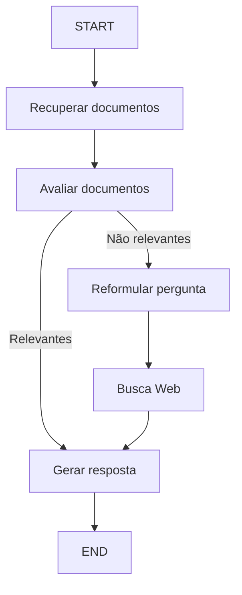

# Corrective RAG (CRAG)

## Visão Geral

O **CRAG** (Corrective Retrieval Augmented Generation) é uma evolução do modelo **RAG** (Retrieval-Augmented Generation).  
Enquanto o RAG se baseia diretamente em documentos recuperados, o CRAG adiciona uma camada de “autocorreção”, capaz de avaliar a confiabilidade desses documentos antes de usá-los na geração de texto.  
Assim, o CRAG reduz o risco de alucinações em Grandes Modelos de Linguagem (LLMs), já que filtra informações enganosas ou fora de contexto, algo que o RAG não faz de forma explícita.

## Motivação

Modelos de linguagem tendem a cometer erros factuais quando se baseiam em informações insuficientes ou incorretas, o que chamamos de **alucinações**.  
O RAG tenta corrigir isso anexando documentos relevantes ao prompt do modelo. Porém, se a recuperação falha, o modelo pode se basear em conteúdo irrelevante, agravando o problema.  
O CRAG resolve esse ponto fraco ao verificar a precisão dos documentos recuperados e, se necessário, busca informações adicionais (por exemplo, via pesquisa na web).

## Principais Diferenças para o RAG

- **Avaliação de Documentos**:  
  No RAG, o conteúdo retornado pelo sistema de recuperação geralmente é inserido sem qualquer triagem;  
  Já no CRAG há um _retrieval evaluator_ que pontua a relevância de cada documento.

- **Ações Baseadas em Confiabilidade**:

  - **Correct**: usa o que foi recuperado, mas ainda passa por uma filtragem interna para destacar apenas trechos relevantes.
  - **Incorrect**: descarta a recuperação inicial e faz buscas externas (web), ampliando a base de conhecimento.
  - **Ambiguous**: mescla informações internas e externas, mantendo maior flexibilidade quando não há certeza absoluta sobre a qualidade dos trechos iniciais.

- **Refinamento de Conhecimento**:  
  Em vez de usar todo o documento (que pode ter parágrafos irrelevantes), o CRAG faz uma decomposição em blocos, filtra o que não serve e recompõe apenas o essencial.

- **Uso de Buscas Externas**:  
  Quando julga que nenhum documento interno é confiável, o CRAG consulta fontes adicionais online, escapando da limitação de um corpus fixo.

## Mecanismo de Autocorreção

O CRAG introduz um módulo de avaliação (por exemplo, **GPT-4o-mini**) que determina se o documento recuperado faz sentido para a consulta do usuário.  
Diferentemente de depender só de um grande modelo, esse módulo rápido e leve possibilita checar várias fontes sem custo computacional exagerado.  
Ao filtrar documentos incorretos ou incompletos, aumenta a segurança do sistema antes de chegar ao modelo gerador principal.

## Vantagens

- **Menos Alucinação**:  
  O CRAG detecta e ignora conteúdo que não se relaciona ao tema da pergunta, reduzindo erros factuais.

- **Maior Flexibilidade**:  
  Decide dinamicamente entre confiar no corpus local ou buscar na web, adaptando-se conforme o tipo de consulta.

- **Plug-and-Play**:  
  Pode ser acoplado em diversos pipelines de geração, pois não exige que o modelo gerador seja re-treinado para avaliar documentos.

- **Robustez**:  
  Em situações em que o sistema de recuperação falha, o CRAG não “desiste”, mas aciona buscas adicionais para garantir que a resposta seja baseada em dados confiáveis.

## Conclusão

O CRAG é um aprimoramento do RAG, oferecendo um filtro de correção que protege o processo de geração contra informações imprecisas.  
Ao avaliar a qualidade dos documentos e alternar entre dados internos e buscas externas, o CRAG mitiga o risco de alucinação e melhora a exatidão das respostas.  
Seu enfoque na reutilização de blocos relevantes e no descarte de partes irrelevantes torna o sistema mais confiável e centrado no que realmente importa para a pergunta feita.

No artigo aqui, são realizadas algumas etapas:

1. Se pelo menos um documento exceder o limite de relevância, então prossegue para a geração.
2. Antes da geração, realiza o refinamento do conhecimento:
   - Divide o documento em "faixas de conhecimento".
   - Avalia cada faixa e filtra as irrelevantes.
3. Se todos os documentos ficarem abaixo do limite de relevância ou se o avaliador estiver em dúvida, o framework busca uma fonte de dados adicional:
   - Utilizará busca na web para complementar a recuperação.

## Implementação (LangGraph)

Vamos implementar algumas dessas ideias do zero usando **LangGraph**:

- Vamos pular a fase de _refinamento do conhecimento_ como primeira abordagem. Isso pode ser adicionado posteriormente como um nó, se desejado.
- Se quaisquer documentos forem irrelevantes, vamos optar por complementar a recuperação com busca na web.
- Usaremos **Tavily Search** para busca na web.
- Vamos usar **reescrita de consulta** para otimizar a busca na web.

Aqui está um documento detalhado em Markdown que explica os conceitos e o funcionamento completo do seu projeto, que usa RAG (Retrieval-Augmented Generation) com um agente baseado em um grafo de execução (Graph / LangGraph):

---

# 📚 Projeto: Sistema de Perguntas e Respostas com RAG e Graph Agent

## Sumário

- [📖 Visão Geral](#📖-visão-geral)
- [📂 Estrutura do Projeto](#📂-estrutura-do-projeto)
- [🛠️ Componentes e Funcionamento](#🛠️-componentes-e-funcionamento)

  - [1️⃣ Repository](#1️⃣-repository)
  - [2️⃣ RelevantDocument](#2️⃣-relevantdocument)
  - [3️⃣ Agent](#3️⃣-agent)

- [⚙️ Workflow do Agente (Graph)](#⚙️-workflow-do-agente-graph)
- [🚀 Fluxo Completo de Execução](#🚀-fluxo-completo-de-execução)
- [📌 Tecnologias Utilizadas](#📌-tecnologias-utilizadas)
- [📚 Conceitos de RAG e Graph](#📚-conceitos-de-rag-e-graph)

---

## 📖 Visão Geral

Este projeto implementa um sistema de Resposta a Perguntas (QA - Question Answering) que combina RAG (Retrieval-Augmented Generation) com um agente programável em grafo usando **LangGraph**.

O sistema é capaz de:

✅ Recuperar documentos de uma base vetorial
✅ Avaliar se os documentos são relevantes à pergunta
✅ Reformular a pergunta se necessário
✅ Fazer busca na web como fallback
✅ Gerar uma resposta final com base no contexto

---

## 📂 Estrutura do Projeto

```bash
.
├── main.py
├── agent.py
├── repository.py
├── relevant_document.py
└── .env
```

---

## 🛠️ Componentes e Funcionamento

### 1️⃣ `Repository`

Arquivo: `repository.py`

Responsável por:

✅ Carregar URLs (posts do blog)
✅ Fazer _Web Scraping_ com `WebBaseLoader`
✅ Dividir o texto em chunks com `RecursiveCharacterTextSplitter`
✅ Gerar embeddings com `OpenAIEmbeddings`
✅ Salvar os embeddings em um banco vetorial com `ChromaDB`

```python
vectorstore = Chroma.from_documents(
    documents=doc_splits,
    collection_name="rag-chroma",
    embedding=OpenAIEmbeddings(),
    persist_directory="./chroma_db"
)
```

Retorna: um `retriever` que permite buscar documentos relevantes a uma pergunta.

---

### 2️⃣ `RelevantDocument`

Arquivo: `relevant_document.py`

Responsável por:

✅ Classificar a relevância de documentos com um _grader_ binário (sim/não)
✅ Gerar a resposta final com base nos documentos
✅ Reescrever a pergunta caso necessário

Componentes:

#### a) `GradeDocuments` (LLM Grader)

Modelo Pydantic que define um output esperado com score `"sim"` ou `"não"`.

#### b) `relevant()`

- Recupera documentos do retriever
- Avalia a relevância com um LLM (modelo `"gpt-4.1-nano"`)

#### c) `generate()`

- Utiliza um prompt RAG (`rlm/rag-prompt`)
- Invoca o modelo para gerar a resposta com base nos documentos

#### d) `question_rewriter()`

- Reescreve perguntas para melhorar a busca
- Exemplo: converte "Chain of Hindsight" para algo mais descritivo

---

### 3️⃣ `Agent`

Arquivo: `agent.py`

Responsável por:

✅ Definir o workflow de execução em forma de grafo (LangGraph)
✅ Controlar o fluxo entre as etapas:

- Recuperação de documentos
- Avaliação de relevância
- Reformulação da pergunta
- Busca na Web
- Geração final de resposta

#### `GraphState`

Define o estado que é passado entre os nós do grafo:

```python
class GraphState(TypedDict):
    question: str
    generation: str
    web_search: str
    documents: List[str]
```

---

## ⚙️ Workflow do Agente (Graph)



---

## 🚀 Fluxo Completo de Execução

Arquivo: `main.py`

1️⃣ Cria o repositório e indexa os documentos
2️⃣ Cria o componente de avaliação e geração
3️⃣ Cria o agente com as etapas definidas no grafo
4️⃣ Roda o grafo com uma pergunta inicial

```python
agent = Agent(retriever, rag_chain, retrieval_grader, question_rewriter)
app = agent.create_workflow()
agent.run(app)
```

Exemplo de pergunta:

```python
"Quais são os tipos de memória de agentes?"
```

---

## 📌 Tecnologias Utilizadas

- `LangChain`
- `LangGraph`
- `ChromaDB`
- `OpenAIEmbeddings`
- `ChatOpenAI`
- `TavilySearchResults` (busca Web)
- `.env` para variáveis de ambiente

---

## 📚 Conceitos de RAG e Graph

### ✨ RAG - Retrieval-Augmented Generation

Estratégia que **combina LLMs com uma base de conhecimento**:

- Em vez de depender 100% do LLM, recupera documentos relevantes
- Usa os documentos como "contexto" para gerar uma resposta mais factual
- Mitiga alucinações do LLM

### 🔄 Graph (LangGraph)

Representa o fluxo de execução de um agente como um **grafo de estados**:

- Cada nó executa uma etapa (ex: recuperar, avaliar, gerar)
- Condições definem os caminhos (ex: "documentos não relevantes → reformular pergunta")
- Permite controle fino e transparência no processo
